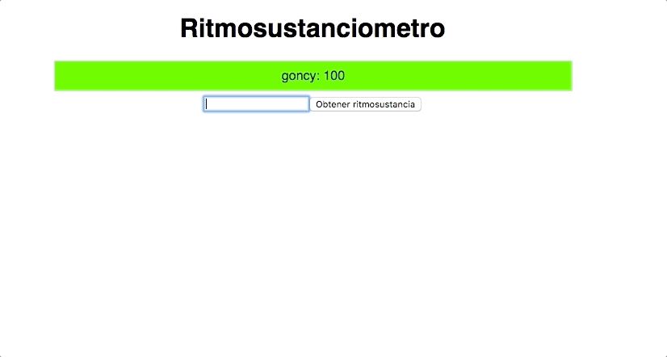

# Metiendo ritmo y sustancia en dos japish👋 con `React` y `Styled Components`
* `React` es una librería para crear interfaces de usuario, la vamos a usar para manejar las vistas y lógica de nuestra aplicación.
* Usar solamente el `CSS` que soportan los navegadores hace que nuestros estilos sean verbosos, limitados o complicados de mantener en una aplicación grande.
Vamos a usar `Styled Components` para mejorar esa experiencia.

## ❓ Qué vamos a hacer?
El `ritmosustanciometro`, una aplicación que obtiene el porcentaje de ritmo y sustancia de un individuo en tiempo real.

## 🎯 Requisitos
* Conocimiento básico de `HTML`, `CSS` y `JavaScript`

## 🍪 Recomendable
* Conocimiento básico de `React`
* Conocimiento básico de ES6 (arrow functions, destructuring, template literals, etc)

## 🛠 Materiales
* 🎟 [Proyecto inicial](https://codesandbox.io/s/cliente-ritmosustanciometro-n61hr)
* 🔗 [Endpoint obtener ritmo y sustancia](https://xb8ek.sse.codesandbox.io/)
* 🎬 [Slides](https://docs.google.com/presentation/d/1LtpsEyeeFJA-MUaAnACV1H_W9Dr0K6EXSgXF0i9xQyo/edit#slide=id.g37ccca1cd0_0_16)

## 📚 Introducción
* [React](./docs/tools/react.md)
* [Styled Components](./docs/tools/styled-components.md)

## 👣 Pasos
* ⚗️ [Armar el ritmosustanciometro](./docs/steps/01-armar-ritmosustanciometro.md)
* 🎨 [Estilar el ritmosustanciometro](./docs/steps/02-estilar-ritmosustanciometro.md)

## 📝 Ejercicios
Ahora es tu turno, usa `React` y `Styled Components` para crear tu propio `ritmosustanciometro`! (o en vez de medir ritmosustancia podés medir otra cosa mas útil que encuentres (aunque no creo que haya nada mas útil), no te limites a copiar lo que hace el proyecto original, dale tu ritmo y sustancia para armar algo piola, sino *japish*👋

* Deshabilitar el boton de `obtener ritmosustancia` si el nombre esta vacío
* Deshabilitar el botón de `obtener ritmosustancia` mientras se está haciendo el pedido al servidor
* Estilar el `ritmosustanciometro`
* Agregar un botón para eliminar todos los resultados de `ritmosustancia`
* Pasar los estilos de `index.css` a un componente con `createGlobalStyles` de `Styled Components`

## 🤷‍♂️ Y ahora que?
Ahora sabes un poco de muchas cosas, convertí lo poco en mucho y hace mucho con poco!, we, re filosofo el goncy, *Japish*👋. Tomá en cuenta algo, acabás de ver muchas cosas nuevas, cada una tiene su complejidad, no esperes saber todo ya ni te desmotives si no sale a la primera, después de todo, nadie nace sabiendo hacer un fernet, o codear en React. Asi que no te olvides, en el [Slack de freeCodeCampBA](https://freecodecampba.org/chat/), estamos para ayudar y contestar dudas siempre.

## 🔗 Links útiles
* [React Developer Tools](https://chrome.google.com/webstore/detail/react-developer-tools/fmkadmapgofadopljbjfkapdkoienihi)
* [React oficial](https://reactjs.org/)
* [Styled Components oficial](https://www.styled-components.com/)
* [Curso inicial de React](https://egghead.io/courses/the-beginner-s-guide-to-reactjs)

## 🗣 Algunas de mis lecciones
* [Cypress](https://github.com/goncy/cypress-lesson)
* [Recompose](https://github.com/goncy/recompose-lesson)
* [Ramda](https://github.com/goncy/ramda-lesson)

---
*Si encontrás un error, typo, cagada, moco o calificativo negativo, avisame o haceme un PR, gracias!*

**by [@goncy](http://github.com/goncy)**
