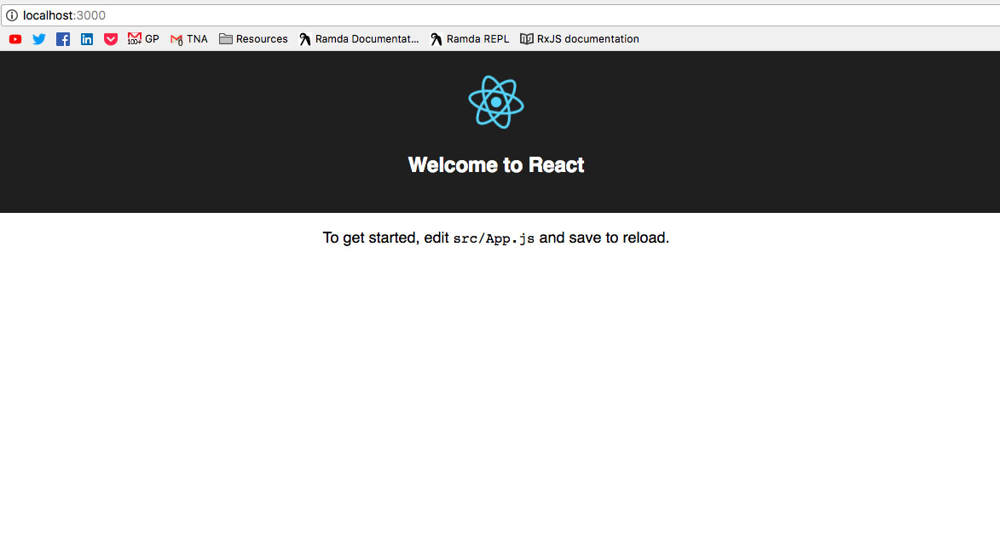
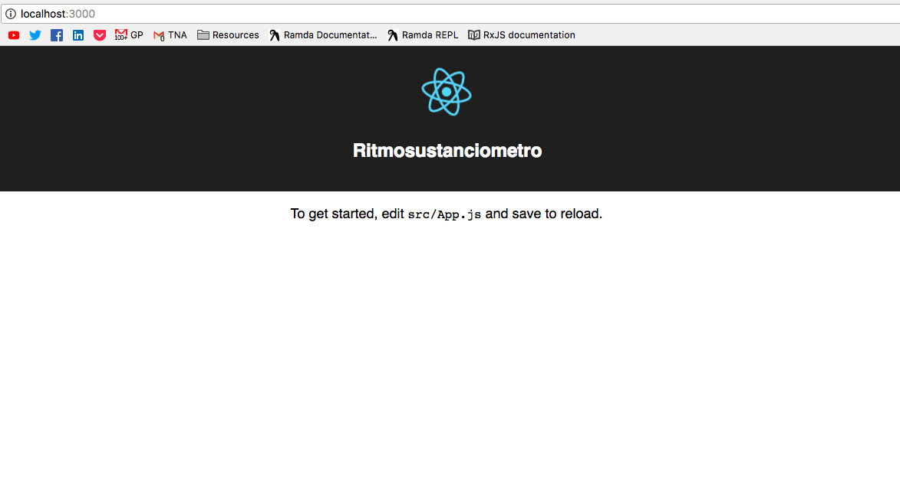

# Creando nuestra aplicación base
Para crear nuestra aplicación base vamos a usar una herramienta llamada `create-react-app`, esta herramienta nos crea un proyecto de `React` listo y configurado para poder trabajar no solo con `React` sino que también con ES6 y varias herramientas que nos van a ahorrar mucho tiempo.

## Crear el proyecto base
La forma mas fácil es usando `npx`, una herramienta de `npm` que viene integrada desde la version 5.2.0, así que si seguiste los requerimientos e instalaste la última versión estable de `node` y `npm` la tenés, sino...


Para usarla simplemente tenemos que ir a la terminal, pararnos en la carpeta donde queramos crear nuestro proyecto (`~/projects/` es la mía por ejemplo) y corremos:
```bash
npx create-react-app ritmosustanciometro
```
Esto va a tomar el paquete `create-react-app` de `npm` y lo va a ejecutar sin instalarlo global ni local (esto está bueno para no tener que preocuparse de tener un paquete actualizado, como cuando lo instalamos con `npm install -g <paquete>`).

Una vez que termine, vamos a tener una nueva carpeta llamada `ritmosustanciometro` en la carpeta donde corrimos el comando (`~/projects/ritmosustanciometro` por ejemplo), vamos a hacerle caso al script y vamos a poner en consola `cd ritmosustanciometro` y luego `npm start`. Luego de esto (y unos segundos) se debería abrir una pestaña del navegador con una ventana como esta:



## Asegurarnos que todo anda
Ahora vamos a ir a nuestro editor por defecto (yo voy a usar `Visual Studio Code`) y abrímos la carpeta `ritmosustanciometro`.
Ahora para asegurarnos de que todo está andando correctamente, vamos a la carpeta `src` y abrimos el archivo `App.js`, vamos a buscar el texto `Welcome to React` y lo vamos a cambiar por `Ritmosustanciometro`.
Guardamos y luego de unos segundos vamos a ver que nuestro navegador se refresco automaticamente y podemos ver el nuevo texto en pantalla.



## Conclusión
Felicitaciones! ya tenés una aplicación `React` corriendo y lista para modificar.

[⏪ Cypress](../tools/cypress.md) | [Armando el `ritmosustanciometro` ⏩](./02-armar-ritmosustanciometro.md)
