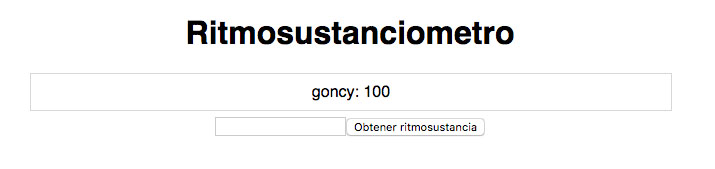
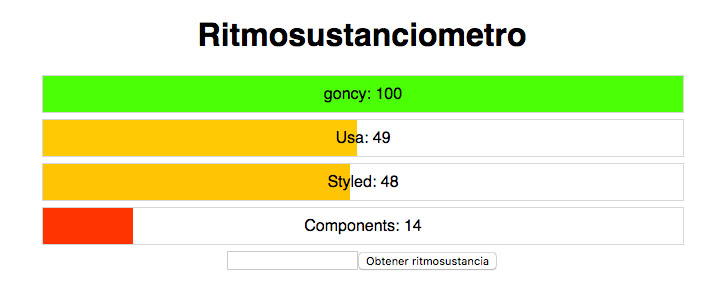

# Estilando el `ritmosustanciometro`
Para empezar a estilar nuestro `ritmosustanciometro` vamos a:

1. Agregar `Styled Components` a nuestro proyecto
2. Definir estilos globales para nuestra aplicación
3. Crear un `Container` de estilos para `App.js`
4. Crear un `Container` de estilos para `Ritmosustanciometro.js`
5. Convertir a `Ritmosustanciometro.js` en una barra de carga
6. Crear animaciones de aparición y de carga
7. Aplicar las animaciones a `Ritmosustanciometro.js`

### Agregar `Styled Components` a nuestro proyecto
Vamos a volver a la terminal, nos paramos en la carpeta `ritmosustanciometro` y ejecutamos:
```bash
npm install styled-components --save
```
Esperamos que termine de instalar y listo!

### Definir estilos globales para nuestra aplicación
Vamos a ir al archivo `index.css` y vamos a pegar lo siguiente:
```css
html, body, #root {
  font-family: sans-serif;
  justify-content: center;
  text-align: center;
  display: flex;
  flex: 1;
  margin: 0;
  padding: 0;
}
```
Con esto simplemente nos vamos a asegurar de que nuestra aplicación ocupe el espacio que necesita, se centre y que tenga una font un poco mas respetable

### Crear un `Container` de estilos para `App.js`
Vamos a ir a `App.js`. Vamos a importar `Styled Components`, crear un `Container` de `styled.div` con unos estilos básicos y vamos a usarlo como contenedor de nuestro componente `App`:

```jsx
// App.js
import React, { useState } from 'react';
import styled from "styled-components" // Importamos `Styled Components`

import Ritmosustanciometro from './Ritmosustanciometro';

// Creamos un container de `styled.div` con unos estilos básicos
const Container = styled.div`
  width: 100%;
  max-width: 640px;
`

function App() {
  const [nombre, setNombre] = useState('');
  const [individuos, setIndividuos] = useState([
    {
      nombre: 'goncy',
      ritmosustancia: 100,
    },
  ]);

  function actualizarNombre(event) {
    setNombre(event.target.value);
  }

  async function obtenerRitmosustancia(event) {
    event.preventDefault();

    const request = await fetch(
      'https://wt-3581e5a0e6c19bb4a0552203b2738a9d-0.run.webtask.io/obtener-ritmosustancia'
    );
    const response = await request.json();

    setIndividuos(
      individuos.concat({
        nombre: nombre,
        ritmosustancia: response,
      })
    );
    setNombre('');
  }

  return (
    {/* Usamos `Container` como contenedor de nuestra app */}
    <Container>
      <h1>Ritmosustanciometro</h1>
      {individuos.map(individuo => (
        <Ritmosustanciometro
          nombre={individuo.nombre}
          ritmosustancia={individuo.ritmosustancia}
        />
      ))}
      <form onSubmit={obtenerRitmosustancia}>
        <input type="text" value={nombre} onChange={actualizarNombre} />
        <button type="submit">Obtener ritmosustancia</button>
      </form>
    </Container>
  );
}

export default App;
```

### Crear un `Container` de estilos para `Ritmosustanciometro.js`
Vamos a hacer lo mismo que en nuestro componente `App`:

```jsx
// Ritmosustanciometro.js
import React from "react";
import styled from "styled-components"; // Importamos `Styled Components`

// Creamos un container de `styled.div` con unos estilos básicos, ancho, alto, margen, borde y alineamos el contenido al centro
const Container = styled.div`
  width: 100%;
  height: 36px;
  margin: 6px 0;
  display: flex;
  align-items: center;
  justify-content: center;
  border: 1px solid gainsboro;
`

// Usamos `Container` como contenedor de nuestro componente `Ritmosustanciometro`
const Ritmosustanciometro = ({nombre, ritmosustancia}) => (
  <Container>
    {nombre}: {ritmosustancia}
  </Container>
);

export default Ritmosustanciometro;
```



### Convertir a `Ritmosustanciometro.js` en una barra de carga
Vamos a cambiar un poco la estructura del `Ritmosustanciometro` para que parezca una barra de carga marcando el nivel de `ritmosustancia`:

```jsx
// Ritmosustanciometro.js
import React from "react";
import styled from "styled-components";

const Container = styled.div`
  width: 100%;
  height: 36px;
  margin: 6px 0;
  display: flex;
  align-items: center;
  justify-content: center;
  position: relative;
  border: 1px solid gainsboro;

  .barra {
    position: absolute;
    height: 100%;
    top: 0;
    left: 0;
    background-color: hsl(${props => props.ritmosustancia}, 100%, 50%);
    width: ${props => props.ritmosustancia}%;
  }

  .cantidad {
    z-index: 1;
  }
`

const Ritmosustanciometro = ({nombre, ritmosustancia}) => (
  {/* Le pasamos el valor de `ritmosustancia` a nuestro container para poder usarlo en nuestros estilos */}
  <Container ritmosustancia={ritmosustancia}>
    {/* Creamos un `div` para mostrar el `nombre` y el valor de `ritmosustancia` y otro para mostrar la barra de nivel de `ritmosustancia`, les asignamos las clases que definimos mas arriba */}
    <div className="cantidad">{nombre}: {ritmosustancia}</div>
    <div className="barra" />
  </Container>
);

export default Ritmosustanciometro;
```



Perfecto, `Styled Components` nos permitió usar el valor de `ritmosustancia` de `props` para cambiar el color y ancho de nuestra barra de nivel de `ritmosustancia`

### Crear animaciones de aparición y de carga
Vamos a crear un archivo `animaciones.js` dentro de `src`, al mismo nivel que el resto de nuestros componentes. Vamos a importar `keyframes` de `Styled Components` y vamos a crear dos animaciones, una `aparecerDeAbajo` y una `carga`, ambas las vamos a usar en `Ritmosustanciometro`:

```javascript
import {keyframes} from "styled-components";

// Inicia 20px mas abajo con `opacity` 0, luego se acomoda y aparece
export const aparecerDeAbajo = keyframes`
  0% {
    transform: translateY(20px);
    opacity: 0;
  }

  100% {
    transform: translateY(0px);
    opacity: 1;
  }
`

// Inicia con un ancho de 0 y color rojo y toma el ancho y color del argumento `valor` que le pasemos
export const carga = valor => keyframes`
  0% {
    width: 0;
    background-color: hsl(0, 100%, 50%);
  }

  100% {
    background-color: hsl(${valor}, 100%, 50%);
    width: ${valor}%;
  }
`
```

> Tip: `hsl` significa `hue saturation lightness`, por lo tanto `hsl(0, 100%, 50%)` sería rojo y `hsl(100, 100%, 50%)` sería verde

### Aplicar las animaciones a `Ritmosustanciometro.js`
Vamos a importar las animaciones que acabamos de crear a `Ritmosustanciometro.js` y vamos a aplicarlas:
```jsx
// Ritmosustanciometro.js
import React from "react";
import styled from "styled-components";

import {carga, aparecerDeAbajo} from "./animaciones" // Importamos las animaciones

const Container = styled.div`
  width: 100%;
  height: 36px;
  margin: 6px 0;
  animation: ${aparecerDeAbajo} 1s ease-in-out;
  display: flex;
  align-items: center;
  justify-content: center;
  position: relative;
  border: 1px solid gainsboro;

  .cantidad {
    z-index: 1;
  }

  .barra {
    position: absolute;
    height: 100%;
    top: 0;
    left: 0;
    animation: ${(props) => carga(props.ritmosustancia)} 1s ease-in-out;
    animation-fill-mode: forwards;
  }
`

const Ritmosustanciometro = ({nombre, ritmosustancia}) => (
  <Container ritmosustancia={ritmosustancia}>
    <div className="cantidad">{nombre}: {ritmosustancia}</div>
    <div className="barra" />
  </Container>
);

export default Ritmosustanciometro;
```


### Conclusión
Ya tenemos nuestro `ritmosustanciometro` con un poco mas de onda!, vamos a testearlo con `Cypress`


[⏪ Armando el `ritmosustanciometro`](./02-armar-ritmosustanciometro.md) | [Testeando el `ritmosustanciometro` ⏩](./04-testear-ritmosustanciometro.md)
