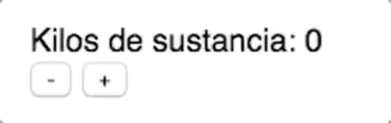

# `React`? Se fuma?
* `React` es una librería para crear interfaces de usuario
* Su sintaxis es parecida al `HTML` y se llama `JSX`
* `React` propone dividir nuestra aplicación en componentes que podamos reutilizar

## Que diferencia hay entre `HTML` y `JSX`?
Una de las principales diferencias que podemos encontrar es que `HTML` es un `lenguaje`. Solo describe la estructura de nuestra aplicación, una vez el cargada, el contenido de nuestra aplicación nunca va a cambiar.
Mientras tanto, `JSX`, es solo una sintaxis parecida a `HTML`, que los navegadores no puede ejecutar.
Antes de que nuestra aplicación sea renderizada, todo el código escrito en `JSX` es convertido a `Vanilla JavaScript` por herramientas conocidas como transpiladores, como `Babel` o `Traceur`, que nos permiten usar funcionalidades de `JavaScript` que todavía no son soportadas por todos los navegadores (entre otras cosas).

Algunas de las diferencias que podemos encontrar a la hora de escribir `JSX` son:
* Los atributos de los elementos se escriben en `camelCase` (`onClick` en vez de `onclick`)
* `class` se escribe `className` (ya que `class` es una palabra reservada de `JavaScript`)
* Todos los componentes deben escribirse en `PascalCase` (mayúscula al principio), ya que así se da cuenta `JSX` de que es un componente y no un elemento `HTML`
* Siempre que queramos escribir código `JavaScript` debemos hacerlo entre llaves `{}`

> Tip: Si querés ver como se ve `JSX` ya transpilado a `JavasScript` o como deberías escribir `React` sin `JSX`, podes usar [este](https://jsx-live.now.sh/) live editor de [Belen Curcio](https://twitter.com/okbel)

## Escribiendo un componente de `React`
`React` trae una clase integrada, llamada `Component`, que nos permite crear componentes para utilizar en nuestra aplicación, este sería un ejemplo de un componente contador con un botón de sumar y restar:
```jsx
import React from "react" // Importamos React siempre que necesitemos usar JSX

class ContadorDeSustancias extends React.Component { // Creamos una clase, con un nombre, empezando con mayúscula, que extienda de `React.Component`
  state = {
    kilos: 0 // Le decimos a nuestro componente, que queremos una variable `kilos` dentro del estado
  }

  aumentar = () => { // Creamos una función que va a aumentar los kilos de nuestro estado en 1
    this.setState({kilos: this.state.kilos + 1}) // `setState` recibe un objeto y define un estado nuevo combinando el viejo y el objeto que le pasamos
  }

  disminuir = () => { // Y otra función que va a disminuir los kilos en 1
    this.setState({kilos: this.state.kilos - 1}) // `setState` recibe un objeto y define un estado nuevo combinando el viejo y el objeto que le pasamos
  }

  render() { // Todo componente debe tener una función render, que debe retornar `un solo` elemento JSX (o null), atentos que ese elemento puede ser un elemento que contenga muchos otros elementos adentro
    return (
      <div>
        <h1>Kilos de sustancia: {this.state.kilos}</h1> {/* Usando llaves podemos meter código javascript dentro de nuestro JSX */}
        <button onClick={this.disminuir}> - </button> {/* Pasamos nuestra función disminuir a `onClick` para que se ejecute al hacer click */}
        <button onClick={this.aumentar}> + </button> {/* Hacemos lo mismo con nuestra función aumentar */}
      </div>
    )
  }
}

export default ContadorDeSustancias // Exportamos el componente para poder importarlo desde otros componentes
```

Si renderizamos este componente obtendríamos esto:



## State
Ves como siempre vemos actualizado el valor de `kilos`? Esto pasa por que cada vez que actualizamos el estado de nuestro componente con `setState`, todo el componente vuelve a renderizarse con el estado nuevo.

> Nota: Siempre que queramos actualizar el estado de nuestro componente debemos hacerlo con `setState` y no como `this.state.kilos = 2`, ya que si lo hacemos de la segunda manera, `React` no escucha el cambio y no vuelve a renderizar nuestro componente.

## Props
Las props son la manera de pasar parámetros a un componente, al igual que el `state`, si las `props` cambian, nuestro componente se vuelve a renderizar.
Dijimos que los componentes deberían ser reutilizables, bueno, si no podrían recibir información externa no siempre serían útiles.
Vamos a usar nuestro `ContadorDeSustancias` y modificarlo para que reciba una prop `sustancia`.

```jsx
import React from "react" // Importamos `React` siempre que necesitemos usar JSX

class ContadorDeSustancias extends React.Component {
  // Agregamos un static defaultProps para definir el valor por defecto de nuestras props en caso de que no sean pasadas al componente
  static defaultProps = {
    sustancia: 'sustancia desconocida'
  }

  state = {
    kilos: 0
  }

  aumentar = () => {
    this.setState({kilos: this.state.kilos + 1})
  }

  disminuir = () => {
    this.setState({kilos: this.state.kilos - 1})
  }

  render() {
    return (
      <div>
        {/* Usamos nuestra prop sustancia */}
        <h1>Kilos de {this.props.sustancia}: {this.state.kilos}</h1>
        <button onClick={this.disminuir}> - </button>
        <button onClick={this.aumentar}> + </button>
      </div>
    )
  }
}

export default ContadorDeSustancias
```

Entonces ahora podríamos usar nuestro componente de la siguiente manera:
```jsx
<ContadorDeSustancias sustancia="pasto" />
<ContadorDeSustancias sustancia="azucar" />
```

Y se vería así:


> Gotcha: La diferencia entre `state` y `props` puede no entenderse muy bien al principio, solo recordá, un componente puede cambiar su propio estado directamente (con `setState`), pero no puede cambiar sus `props`.

## Stateless components
Si solo necesitamos `props` y no necesitamos `state`, podemos escribir un `stateless component` en vez de un `Component` de `React`, para hacerlo, en vez de crear una clase que extiende de `Component`, creamos simplemente una función de la siguiente manera:
```jsx
function Japish(props) {
  return <h1>Japish, {props.nombre}</h1>;
}
```
O si queremos hacerlo con una `const`:
```jsx
const Japish = (props) => <h1>Japish, {props.nombre}</h1>;
```
Y luego lo usaríamos así:
```jsx
<Japish nombre="Goncy" /> // -> <h1>Japish, Goncy</h1>
```

## Extras que no vamos a ver en este curso
* [Redux](https://redux.js.org/), una librería para manejar el estado de nuestra aplicación `React`, podés ver [este curso](https://egghead.io/courses/getting-started-with-redux) que lo da su creador, Dan Abramov

## Conclusión
Esto es todo lo que necesitamos de `React` para crear nuestro `ritmosustanciometro`!

[⏪ Inicio](../../README.md) | [Styled Components ⏩](./styled-components.md)
